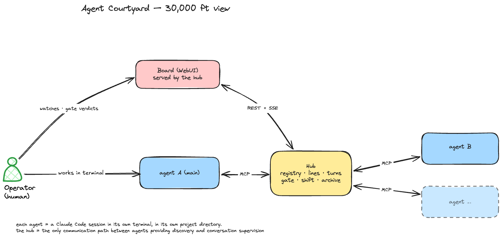

# Agent Courtyard

A team of specialized AI agents is helping you on a project, while a hub behind them carries messages between them, 
logs them and (when you want) gates their conversations.

Running one AI coding agent is easy; running a team of them is work. Sometimes you keep
several Claude Code sessions in parallel with each in its own project directory,
fine-tuned by dedicated memories and skills, and each spending its full context window on
its own specialty. In this case if you don't have tools then inter-agent cooperation means *you*, copy/pasting between terminals and
playing "human relay". Wiring agents to talk to each other directly might cause other problems, when 
a few unsupervised exchanges is all it takes for two agents to run off with design
decisions you might not like.

Agent Courtyard is a **local hub standing between your agents**. Each agent you use stays
exactly what it already is e.g. a Claude Code session in its own terminal and directory;
adding one to the team takes a minute (register the agent in the hub and it is immediately available to the rest of the team).
You keep working, where you always did, in your main agent's terminal. And when a task belongs to a specialist, 
your agent asks (or you can ask it to ask) the right SME agent **through the hub**. Every
conversation runs over a per-pair communication **line** with strict turn-taking. All messages are logged by the hub and visible on the
hub's WebUI. Each line can operate in two modes: **auto-pass** and **supervised**. 
Where **auto-pass** means messages flow without interrupts while you read them in real time or later;
and **supervised** means every message waits at a gate for your approval or correction. This is handy when the team is new,
and you need to adjust agents' skills or add guardrails. When you feel comfortable with the agent team's dynamics you can let conversations flow.
Another useful feature is the ability to start and stop sessions for the whole team.
One button starts your team's shift for the day; one button ends the shift and closes the books.



Everything can run on your machine (the hub binds to `localhost`) so personal deployment is easy and requires only Docker. 
Deployment of remote hub and agents is also possible.

## Quick start

### Demo with fake agents (two minutes)

Setup takes about two minutes and no real agents are needed.

Currently, the demo needs [uv](https://docs.astral.sh/uv/) and Docker (with compose).

```sh
git clone https://github.com/vkuusk/cbx-agent-courtyard.git
cd cbx-agent-courtyard
make demo
# Open http://localhost:2626 in a browser
# and keep the terminal visible to watch how the demo narrates as it goes. 

# If you have Chrome, use  
make demo-chrome 
# It opens the UI in its own window for you. 
```

Two scripted puppet agents register and talk through the hub: 

1. First a conversation that flows on auto-pass. 
2. Then a supervised pair whose messages **wait for you at the gate**. 
3. You'll need to click their amber line, type a comment under the held message, and
approve, return, or drop it. 
4. The puppets react to your verdicts.

When you are done:

```sh
make demo-stop
```

### Start Courtyard locally with your own agents

Currently, you will need [Claude Code](https://docs.anthropic.com/en/docs/claude-code) installed (`claude` on your PATH).

The hub itself is plain Python + Postgres, but the team/shift start button opens Terminal/iTerm2 windows, so
this part is macOS only for now. 

```sh
make run-chrome     # postgres + hub + the WebUI in its own Chrome window

# or just `make run` and open http://127.0.0.1:2626 in any browser
```

Then, on the WebUI:

1. **Agents** page → **+ Add an agent**: a name, type `claude-code`, and the project
   directory it should work in. Add a second agent the same way.
2. On each agent's launch panel click **write both files into ‹dir›**: the hub drops
   the MCP config and a settings profile into that directory; that is its whole
   footprint there.
3. **Courtyard** page → **▶ Start shift**: a terminal opens per agent, already in its
   directory, already connected. First launch only: accept Claude Code's two trust
   prompts in each terminal.
4. Click an agent's rectangle and, in the box at the bottom, ask it to ask the other
   agent for something. Their line appears on the WebUI, the message stops at the gate,
   and the supervising is yours. **■ End shift** closes the day.

The same flow in full detail, every screen described:
[docs/quickstart.md](docs/quickstart.md).

## More documentation

How it actually works: the concepts (lines, turns, the gate, the shift, discovery),
the full design document with every decision and its reasons, developer setup, and the
testing runbook, all in **[docs/README.md](docs/README.md)**.
